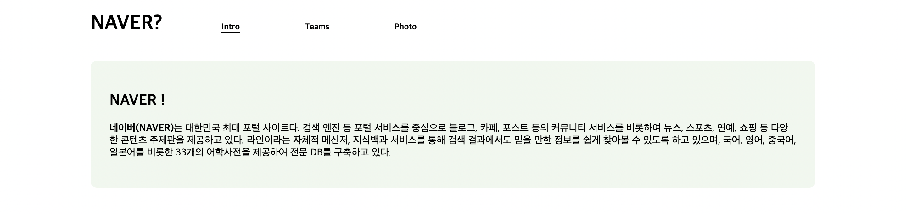
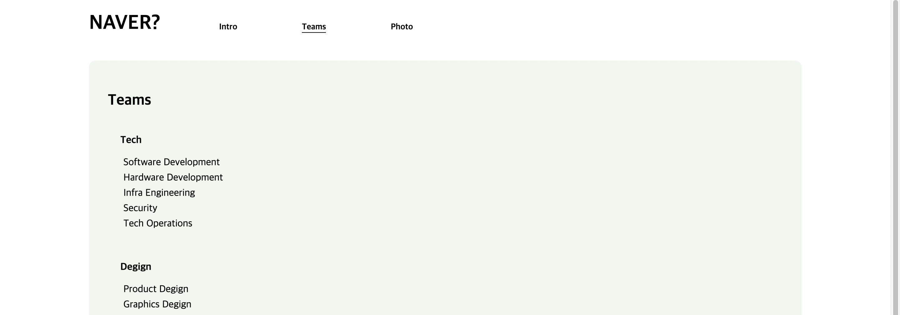
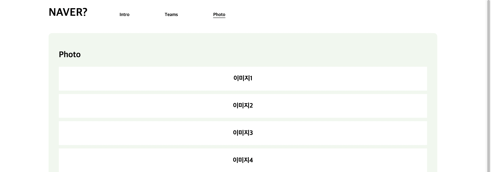
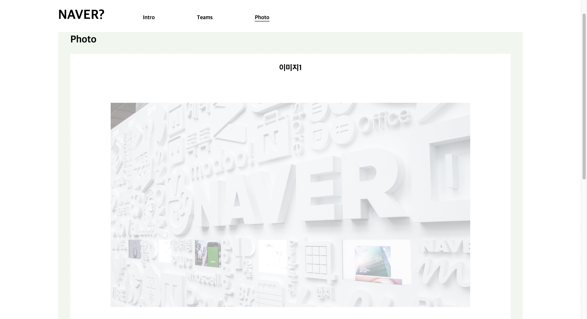
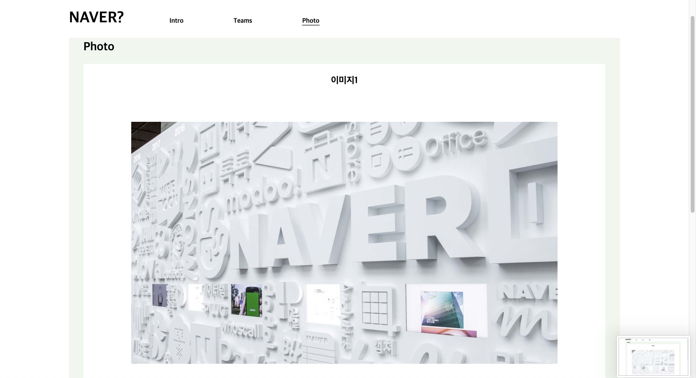

# 회사 소개 사이트 제작 - NAVER

   
  
  
  
  
  
   

 

## 프로젝트 소개

  제가 가고 싶은 회사인 NAVER의 소개 페이지를 제작해보았습니다. 네이버 기업의 간단한 소개와 직군 소개, 회사 내 사진 등으로 꾸며보았습니다. 
   

  + **헤더** 부분에 페이지 메인 타이틀과 nav바로 메뉴를 이동 가능하게 했습니다. 
  + **메뉴**는 탭바 효과를 적용하여 해당 메뉴를 클릭하거나 터치하면 해당하는 컨텐츠가 화면에 나오도록 설정했습니다. 
  + **포토** 는 제이쿼리를 활용하여 슬라이드 형식으로 보여지게 했고, 마우스를 가져다대면 투명도가 변하도록 했습니다.

 

## 디렉토리 구조

  + **/img**: 웹 페이지에 사용된 이미지 파일이 들어있습니다.
  + **/css**: css 파일이 들어있습니다.
  + **/js**: js 파일이 들어있습니다.
  + **/mdimg**: README.md 파일에 사용된 이미지 파일이 들어있습니다.

 

## 사용 언어 및 프로그램

|   HTML  |   CSS   |   Javascript   |  jQuery  |  vscode  |
| :-----: | :-----: | :------------: | :------: | :------: | 

 

## 배운 점 & 아쉬운 점

   1학년 2학기 때 Javascript와 jQuery를 배웠지만 잘 활용해오지 못했습니다. 그러나 반응형 웹 페이지의 기본 언어인 만큼 이번 기회로 복습하여 앞으로의 프로젝트들에 많이 활용하고 싶습니다. 
   이미지 효과를 아주 간단하게만 설정해봤는데 이것을 좀 더 완성도 있는 효과를 적용하여 완성하고 싶습니다.
  

 

## License

  MIT &copy; [SUIM](mailto:suim0215@gmail.com)
